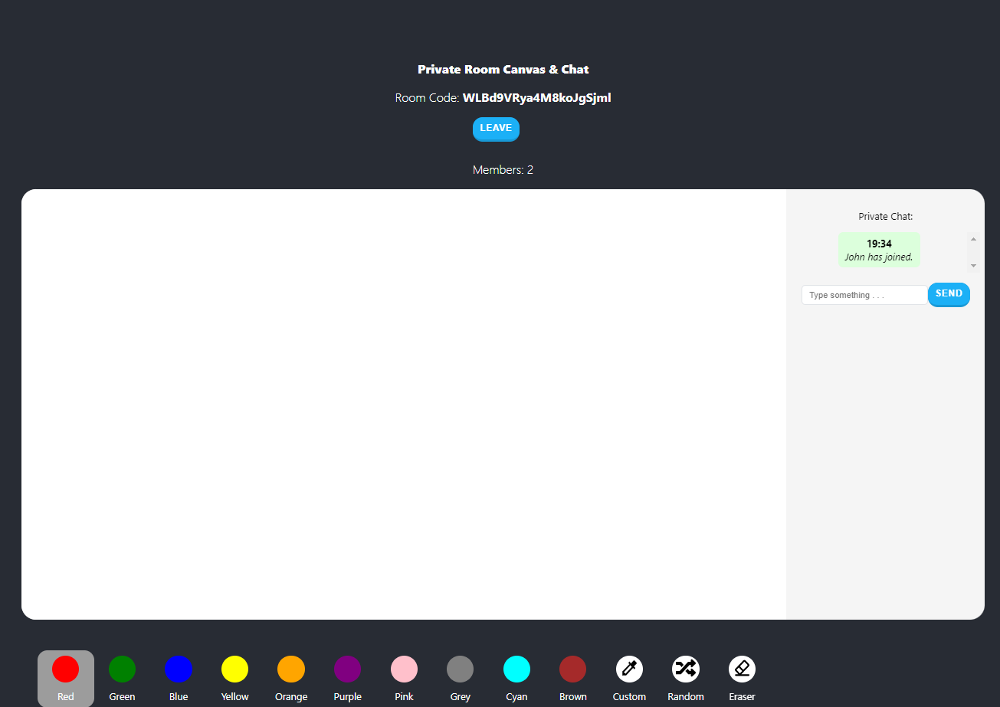

# Collaborative Whiteboard App
Is a online collaborative whiteboard app, where users can draw and chat on a public whiteboard or create their own private rooms with private chat and private whiteboard visible only to them. They can than share their private room code and other people will be able to join. They can also download the whiteboard as an image or mint it as an NFT (on mumbai testnet network).

Please leave a ⭐ if you like it.

## Try It Out
If you find any **errors** ⛔, please report them to [cleancode198@gmail.com](mailto:cleancode198@gmail.com) thanks 🙏.

## Technologies
For this project I used:
- [React](https://reactjs.org/) - framework I used to create frontend
- [TypeScript](https://www.typescriptlang.org/) - used in frontend
- [Solidity](https://soliditylang.org/) - for NFT smart contract
- [Moralis](https://moralis.io/) - for connecting wallet, uploading to IPFS and minting NFT
- [CSS](https://developer.mozilla.org/en-US/docs/Web/CSS)
- [NodeJS](https://nodejs.org/en/) and
- [Socket.io](https://socket.io/) - both to create backend

## About Me
Hi! 👋 I'm Jin, passionate **web and blockchain developer**. Take a look at my portfolio website [here](https://jinkong.netlify.com).

You can get in touch with me through my [website](https://jinkong.netlify.com), contact me on [linkedin](https://linkedin.com/in/jinkong198) or you can send me an email to [cleancode198@gmail.com](mailto:cleancode198@gmail.com).

Do you like my work? You can support me by donating to this address: 0xf18432a6d3C6f8720227C2856dEE97B6d99357EF

## License
[MIT](https://choosealicense.com/licenses/mit/)
